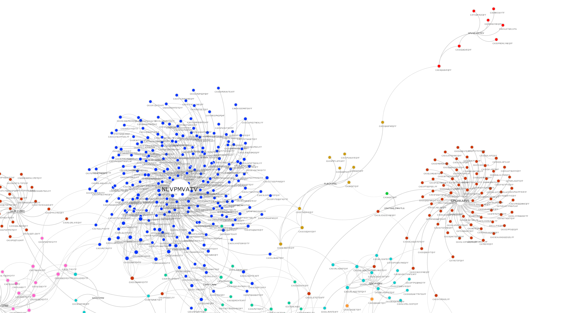

[](https://travis-ci.org/antigenomics/vdjdb-db)

# VDJDB: A curated database of T-cell receptor sequences of known antigen specificity



The primary goal of VDJdb is to facilitate access to existing information on T-cell receptor antigen specificities, i.e. the ability to recognize certain epitopes in certain MHC contexts.

Our mission is to both aggregate the scarce TCR specificity information available so far and to create a curated repository to store such data.

In addition to routine database updates providing the most up-to-date information, we make our best to ensure data consistency and fight irregularities in TCR specificity reporting with a complex database validation scheme:

* We take into account all available information on experimental setup used to identify antigen-specific TCR sequences and assign a single confidence score to highligh most reliable records at the database generation stage.
* Each database record is also automatically checked against a database of V/J segment germline sequences to ensure standardized and consistent reporting of V-J junctions and CDR3 sequences that define T-cell clones.

This repository hosts the submissions to database and scripts to check, fix and build the database itself.

To build database directly from submissions, go to ``src`` directory and run ``groovy -cp . BuildDatabase.groovy`` script (requires [Groovy](http://www.groovy-lang.org/)).

To query the database for your immune repertoire sample(s) use the [vdjmatch](https://github.com/antigenomics/vdjmatch) software.

A web-based GUI for the database can be found in [VDJdb-web](https://github.com/antigenomics/vdjdb-web) repository.

## Citing

Please cite the database using the **most recent** NAR paper ``Dmitry V Bagaev, Renske M A Vroomans, Jerome Samir, Ulrik Stervbo, Cristina Rius, Garry Dolton, Alexander Greenshields-Watson, Meriem Attaf, Evgeny S Egorov, Ivan V Zvyagin, Nina Babel, David K Cole, Andrew J Godkin, Andrew K Sewell, Can Kesmir, Dmitriy M Chudakov, Fabio Luciani, Mikhail Shugay, VDJdb in 2019: database extension, new analysis infrastructure and a T-cell receptor motif compendium, Nucleic Acids Research, gkz874.`` [doi:10.1093/nar/gkz874](https://doi.org/10.1093/nar/gkz874).

## Submission guide

To submit previously published sequence follow the steps below:

* Create an issue(s) labeled as ``paper`` and named by the paper pubmed id, ``PMID:XXXXXXX``. Note that if paper is a meta-study, you can mark it as ``meta-paper`` and link issues for its references in a reply to this issue. Also note that in case submitting unpublished sequences, choose any appropriate issue name with details on submitter (name, organization, etc) in issue comments.

* Create new branch and add chunk(s) for corresponding papers named as ``PMID_XXXXXXX``. Don't forget to close/reference corresponding issues in the commit message.

* Create a pull request for the branch and check if it passes the CI build. If there are any issues, modify them by fixing/removing entries as necessary.

The structure of submission chunk is provided below, but first a couple of notes:

> **STYLE** Try avoiding spaces (e.g. ``TRBV7,TRBV5``, not ``TRBV7, TRBV5``) and leave fields that have no information as blank (don't use any placeholder). Stick to listed field values at all cost! In case a critical part of your submission doesn't fit in current specification: 1) Create an issue in the issues section (and tag it as ``maintainance``), 2) provide us with an example (e.g. open a pull request). Do not insert critical information into the comment field.

> **FORMAT** Please ensure that Variable/Joining and MHC names in your submission come from IMGT nomenclature (this does not apply to donor MHC typing fields).

The ``BuildDatabase`` routine will be executed during CI tests upon each submission and prior to every database release implements table format checks, CDR3 sequence checks and fixes (if possible), and VDJdb confidence score assignment (see below).

To view the list of papers that were not yet processed follow [here](https://github.com/antigenomics/vdjdb-db/labels/paper).

An XLS template is available [here](https://raw.githubusercontent.com/antigenomics/vdjdb-db/master/template.xls).

> **CAUTION** make sure that nothing is messed up (``x/X`` frequencies are transformed to dates, bad encoding, etc) when importing from XLS template. The format of all fields is pre-set to *text* to prevent this case.

## Database specification

Each database submission in ``chunks/`` folder should have the following header and columns:

### Complex information columns (required)

These columns convey full information about TCR:peptide:MHC complex and are mandatory for any submission.

column name     | description
----------------|-------------
cdr3.alpha | TCR alpha CDR3 amino acid sequence. Complete sequence starting with C and ending with F/W should be provided if possible. Trimmed sequences will be fixed at database building stage in case sufficient V/J germline parts are present
v.alpha | TCR alpha Variable (V) segment id, up to best resolution possible (``TRAVX*XX``, e.g. ``TRAV7``, ``TRAV7*01``, ``TRAV7*02``...). Strictly IMGT nomenclature. Can be left blank if unknown.
j.alpha | TCR alpha Joining (J) segment id
cdr3.beta | TCR beta CDR3 amino acid sequence
v.beta | TCR beta V segment id
j.beta | TCR beta J segment id
species | TCR parent species (``HomoSapiens``, ``MusMusculus``,...)
mhc.a | First MHC chain allele, to best resolution possible, ``HLA-X*XX:XX``, e.g. ``HLA-A*02:01``
mhc.b | Second MHC chain allele (``B2M`` for MHCI)
mhc.class | ``MHCI`` or ``MHCII``
antigen.epitope | Amino acid sequence of the epitope
antigen.gene | Parent gene of the epitope sequence (e.g. ``pp24``)
antigen.species | Parent species of the antigen, to the best clade resolution possible (e.g. ``HIV-1``, ``HIV-1*HXB2``)
reference.id | Pubmed id, doi, etc
submitter | Name of submitting person/organization

> **Notes:**

> In case given record represents a clonotype with either TCR alpha or beta sequence unknown, missing CDR3/V/(D)/J fields should be left blank.

> V/(D)/J fields can be left blank, however this will abrogate CDR3 fixing/verification procedure for a given record.

> Any record should have at least one of CDR3 alpha/beta fields that are not blank.

### Method information columns (optional)

Optional columns (i.e. it is not required to fill them, but they **should** be present in table header) that ensure correct confidence ranking of a given entry. Used to calculate a single confidence score based on various factors, e.g. fraction of a given TCRab sequence among tetramer+ clones sequenced and verification experiments performed.

column name     | description
----------------|-------------
method.identification | ``tetramer-sort``, ``dextramer-sort``, ``pelimer-sort``, ``pentamer-sort``, etc for sorting-based identification. For molecular assays use: ``antigen-loaded-targets`` (if T cells specificity was analysed against cells incubatetd with antigenic peptide), ``antigen-expressing-targets`` (if T cells specificity was analysed against cells tranformed with antigenic organism, protein or peptide, e.g. BCL transformed with EBV). For magnetic cell separation use ``beads`` keyword. Add ``cultured-T-cells`` or ``limiting-dilution-cloning`` if T cells were cultured before sequencing as in this case ``method.frequency`` will have completely different meaning. Use comma to separate phrases.
method.frequency | Frequency in isolated antigen-specific population, reported as ``X/X`` if possible, e.g. ``7/30`` if a given V/D/J/CDR3 is encountered in 7 out of 30 tetramer+ clones. Formats ``X%``, ``X.X%`` and ``X.X`` are also supported.
method.singlecell | ``yes`` if single cell sequencing was performed, blank otherwise
method.sequencing | Sequencing method: ``sanger``, ``rna-seq`` or ``amplicon-seq``
method.verification | ``tetramer-stain``, ``dextramer-stain``, ``pelimer-stain``, ``pentamer-stain``, etc for methods that include TCR cloning and re-staining with multimers. For magnetic cell separation use ``beads`` keyword. ``antigen-loaded-targets``, ``antigen-expressing-targets`` for molecular assays that validate specificity of **cloned** T-cell receptors. ``direct`` in case pMHC binding T-cells are directly subject to single-cell sequencing. Several comma-separated verification methods can be specified.

> **Notes:**

> In case ``method.identification`` is left blank, the record is automatically assigned with a lowest confidence score possible.

> For special cases such as CD8-null tetramers that utilize HLA with mutated residues that abrogate CD8 binding, specify ``cd8null-tetramer`` in ``method.identification`` field rather than using ``mhc.a`` field.

During database build phase, the information from columns mentioned above is collapsed to a JSON string and stored in a single ``method`` column, e.g.:
```json
{
   "identification":"tetramer-sort",
   "frequency":"5/13",
   "sequencing":"sanger",
   "verification":"antigen-loaded-targets"
}
```

### Meta-information columns (optional)

column name     | description
----------------|-------------
meta.study.id | Internal study id
meta.cell.subset | T-cell subset, free style, e.g. ``CD8+``, ``CD4+CD25+``
meta.subset.frequency | Frequency of a given TCR sequence in specified cell subset, e.g. ``5%`` means that the TCR sequence represents an expanded clone occupying 5% of CD8+ cells
meta.subject.cohort | Subject cohort, free style, e.g. ``healthy`` or ``HIV+``. If possible, specify to what extent a healthy donor is healthy, e.g. ``CMV-seronegative``.
meta.subject.id | Subject id (e.g. ``donor1``, ``donor2``,...)
meta.replica.id | Replicate sample coming from the same donor, also applies for different time points, etc (e.g. ``5mo``)
meta.clone.id | T-cell clone id
meta.epitope.id | Epitope id (e.g. ``FL10``)
meta.tissue | Tissue used to isolate T-cells: ``PBMC``, ``spleen``, etc. or ``TCL`` (T-cell culture) if isolated from re-stimulated T-cells
meta.donor.MHC | Donor MHC list if available, blank otherwise. IMGT nomenclature (e.g. HLA-A*02:01) is preferable. Allele group names (e.g. ``A02``, ``B18``) is also acceptable (don't use asterisk in such cases). Use comma to separate alleles.
meta.donor.MHC.method | Donor MHC typing method if available, blank otherwise
meta.structure.id | PDB structure ID if exists, or blank. Records having a structural data associated with them will automatically get the highest confidence score.
comment | Plain text comment, maximum 140 characters

> **Note:**

> While these columns are optional, subject identifier, replica identifier, etc are used when scanning submission for duplicates. Normally duplicate records (with identical **complex information** columns) are not allowed, but they will not be considered as duplicates in case they have distinct id fields mentioned above.

During database build phase, the information from columns mentioned above is collapsed to a JSON string and stored in a single ``meta`` column, e.g.:
```json
{
   "cell.subset":"CD8+",
   "subject.cohort":"HSV-2+",
   "subject.id":12,
   "clone.id":46,
   "tissue":"PBMC"
}
```

## Database processing

### CDR3 sequence fixing

At this stage, a series of checks is performed for CDR3 sequence and reported V/J segments:

* In case of *canonical* (starting with conserved ``C`` and ending with ``F/W``) CDR3 sequences: checks if 5' and 3' germline parts match corresponding V/J segment sequences.
* In case of truncated CDR3 sequences: adds conserved ``C/F/W`` residues. Can add more missing residues in case a relatively large contiguous V/J germline match is present.
* In case excessive germline part is reported (e.g. ``FGXG`` instead of simply ``F`` at CDR3 3' part), excessive residues are removed.
* Can correct mismatches in V/J germline regions in case a reliable non-contiguous V/J match is found.

The main reason behind that is that current immune repertoire sequencing (RepSeq) data processing software reports *canonical* clonotype sequences, high number antigen-specific TCR sequences present in literature are reported inconsistently. The latter greatly complicates annotation of RepSeq data using known antigen-specific TCR sequences.

In case of good V/J germline matching and errors in CDR3 sequence, the final CDR3 sequence in the database is replaced by its fixed version. The following report of CDR3 fixer is placed under ``cdr3fix.alpha`` and ``cdr3fix.beta`` columns, e.g.

```json
{
	"fixNeeded":true,
	"good":false,
	"cdr3":"CASSQDVGTGGVFALYF",
	"cdr3_old":"CASSQDVGTGGVFALY",
	"jFixType":"FixAdd",
	"jId":"TRBJ1-6*01",
	"jCanonical":true,
	"jStart":14,
	"vFixType":"FailedBadSegment",
	"vId":null,
	"vCanonical":true,
	"vEnd":-1
	}
```

and

```json
{
	"fixNeeded":true,
	"good":true,
	"cdr3":"CASSLSRGGNQPQYF",
	"cdr3_old":"CASSLSRGGNQPQY",
	"jFixType":"FixAdd",
	"jId":"TRBJ1-5*01",
	"jCanonical":true,
	"jStart":9,
	"vFixType":"NoFixNeeded",
	"vId":"TRBV14*01",
	"vCanonical":true,
	"vEnd":4
}
```

Field descriptions:

field | description
------|-------------
``fixNeeded`` | ``true`` if corrected CDR3 sequence differs from the original one, ``false`` otherwise
``good`` | ``true`` if the fix can be applied, ``false`` if the fix cannot be applied due to bad V/J entry or no V/J matching
``cdr3`` | Fixed CDR3 sequence
``cdr3_old`` | Original CDR3 sequence
``jFixType`` | Type of fix applied to CDR3 J germline part
``jCanonical`` | ``true`` if CDR3 ends with ``F`` or ``W``, ``false`` otherwise
``jId``  | J segment identifier
``jStart``  | A 0-based index of first CDR3 amino acid that belongs to J segment
``vFixType`` | Type of fix applied to CDR3 V germline part
``vCanonical`` | ``true`` if CDR3 starts with ``C``, ``false`` otherwise
``vId`` | V segment identifier
``vEnd``  | A 0-based index of the last CDR3 amino acid of V segment plus one

> **Note:**

> Possible V and J fix types: ``NoFixNeeded``, ``FixAdd``, ``FixReplace``, ``FixTrim``, ``FailedReplace`` (too many mismatches), ``FailedBadSegment`` (bad segment entry), ``FailedNoAlignment`` (no alignment at all)

### VDJdb scoring

At the final stage of database processing, TCR:peptide:MHC complexes are assigned with confidence scores. Scores are computed according to reported **method** entries.

VDJdb scoring is performed by evaluating TCR sequence, identification and verification confidence based on the following criteria:

1. Ensuring TCR sequence is correctly identified according to ``method.sequencing`` and ``method.singlecell`` (1-3 points)
    * sanger - several cells sequenced (2+ cells sequenced according to ``method.frequency``) - 2 points, otherwise 1
    * amplicon-seq - frequency is higher than ``0.01`` - 2 points, otherwise 0
    * single-cell - 3 points if performed
2. Initial identification of TCR:pMHC is correct according to ``method.identification`` (0-1 point)
    * sort-based - frequency is higher than ``0.1`` according to ``method.frequency``)
    * culture-based - frequency is higher than ``0.5``
    * limiting dilution/culture prior to sequencing - the ``method.frequency`` becomes somewhat ambigous, check if it is higher than ``0.5``
3. Verification T-cell specificity (0-3 points)
    * direct method - 3 points, e.g. has PDB id (``meta.structure.id`` is not empty) or some other method that directly evaluates TCR:pMHC binding
    * target stimulation-based - 2 points
    * staining-based - 1 points
    * If verification is performed, then the TCR sequence is assumed to be known, so score from ``1.`` is set to 3

The final score is then calculated as minimal between score from part ``1.`` and sum of scores from part ``2.`` and part ``3.``.

Maximal score is then selected among different records (independent submissions, replicas, etc) pointing to the same unique complex entry (i.e. set of unique **complex** fields).

score | description
------|----------------------
0     | Low confidence/no information - a critical aspect of sequencing/specificity validation is missing
1     | Moderate confidence - no verification / poor TCR sequence confidence
2     | High confidence - has some specificity verification, good TCR sequence confidence
3     | Very high confidence - has extensive verification or structural data

## Database build contents

The final database assembly can be found in the ``database/`` folder upon execution of ``BuildDatabase.groovy`` script:

* ``vdjdb_full.txt`` - combined chunks with TCRalpha/beta records, antigen information, etc. All method and meta information are collapsed into two columns with corresponding names. VDJdb scores and CDR3 fixing information for TCR alpha and beta are given in separate columns. This is the raw version of VDJdb.
* ``vdjdb.txt`` - a collapsed version of database used for annotation of single-chain TCR sequencing data by VDJdb-standalone software. Each line corresponds to either TCR alpha or TCR beta record as specified by the ``gene`` column. TCR records coming from the same alpha-beta pair have the same index in ``complex.id`` column. In case ``complex.id`` is equal to ``0`` a record doesn't have either TCRalpha or TCRbeta chain information. This table is used by VDJdb-standalone and VDJdb-server.
* ``vdjdb.meta.txt`` - metadata for ``vdjdb.txt`` table, used by VDJdb-standalone and VDJdb-server.
* ``vdjdb.slim.txt`` - a slim database used for annotation of single-chain TCR sequencing data by VDJdb-standalone software. This is a collapsed version of ``vdjdb.txt`` containing unique records for each CDR3:antigen pair and comma-separated lists of values for other columns (``*.segm``,``mhc.*``, ``complex.id`` and ``reference.id``). This table can be easily parsed with R and Python/Pandas, it is intended for end users exploring VDJdb.
* ``vdjdb.slim.meta.txt`` - metadata for ``vdjdb.slim.txt`` table.
* ``motif_pwms.txt`` and ``cluster_members.txt`` - position-weight matrices for antigen-specific TCR motifs and representative sets of TCR sequences that constitute them. These tables are computed separately using code from [vdjdb-motifs](https://github.com/antigenomics/vdjdb-motifs) repository.

Note that some statistics can be generated by running R markdown templates in ``summary/`` folder.

## Building database release and generating summary figures

First make sure that you clone both [vdjdb-db repo](https://github.com/antigenomics/vdjdb-db) and [vdjdb-motifs repo](https://github.com/antigenomics/vdjdb-motifs) to the same folder, say ``~/vcs``.

Then navigate to ``vdjdb-db`` and run ``bash release.sh``. You can then find the output in ``~/vcs/vdjdb-db/database``, ``~/vcs/vdjdb-db/summary`` and ``~/vcs/vdjdb-motifs`` folders. Note that you have to check ``.Rmd`` files that will be executed and manually install missing R packages, as well as get [VDJtools binary](https://github.com/mikessh/vdjtools) and place it in the path specified in ``~/vcs/vdjdb-motifs/compute_vdjdb_motifs.Rmd``.

## Database build process with Docker

The repository contains `Dockerfile` to simplify the database building process. `Dockerfile` instantiates the correct environment needed to build the database.
If you have [Docker Desktop](https://www.docker.com/products/docker-desktop) installed and running on your machine use the following command to build local Docker image:

```bash
docker build -t vdjdbdb .
```

In order to build the database using the newly created local Docker image create some folder (e.g. `/tmp/output`) and use it as a external volume when running Docker image. Docker image always puts the result in `/root/output` folder within docker container.

**NOTE**: Host path, e.g. `/tmp/output`, should be absolute.

**NOTE**: Database building process requires at least 64GB of RAM.

```bash
mkdir -p /tmp/output
docker run -v /tmp/output:/root/output vdjdbdb
```

