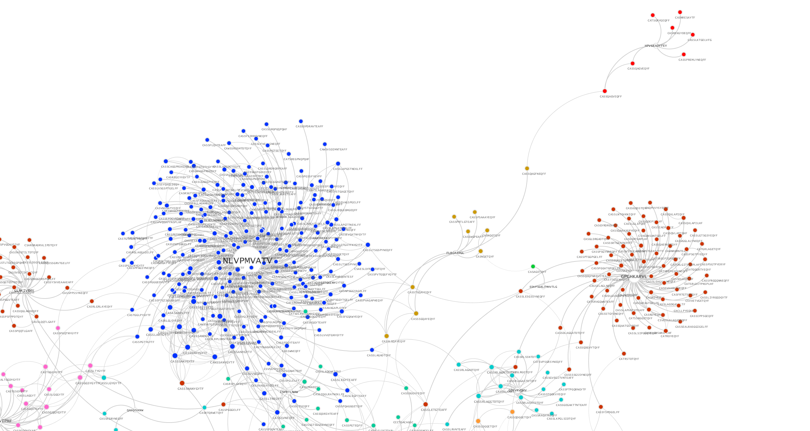

# VDJDB: A curated database of T-cell receptor sequences of known antigen specificity



The primary goal of VDJdb is to facilitate access to existing information on T-cell receptor antigen specificities, i.e. the ability to recognize certain epitopes in certain MHC contexts.

Our mission is to both aggregate the scarce TCR specificity information available so far and to create a curated repository to store such data.

In addition to routine database updates providing the most up-to-date information, we make our best to ensure data consistency and fight irregularities in TCR specificity reporting with a complex database validation scheme:

* We take into account all available information on experimental setup used to identify antigen-specific TCR sequences and assign a single confidence score to highlight the most reliable records at the database generation stage.
* Each database record is also automatically checked against a database of V/J segment germline sequences to ensure standardized and consistent reporting of V-J junctions and CDR3 sequences that define T-cell clones.

This repository hosts the submissions to the database and the build that validates, assembles and publishes it. **`chunks/` is the data** — one file per publication — and everything else is machinery.

## Documentation

**<https://docs.isalgo.dev/vdjdb-db/>** — the full specification. Every column table, vocabulary and
score rule on that site is rendered from the build's own field registry while the page builds, so it
cannot disagree with the code.

| | |
|---|---|
| [Getting started](docs/getting-started.md) | what is in a release, and how to build one |
| [The chunk format](docs/standards/chunk-format.md) | every complex, method and meta column a submission may carry |
| [Column reference](docs/standards/columns.md) | every shipped table, generated from the registry |
| [The confidence score](docs/standards/confidence-score.md) | 0–3, and what each level asserts |
| [CDR3 fixing](docs/standards/cdr3-fixing.md) | how V/J anchors are repaired, and what `cdr3fix` records |
| [AIRR mapping](docs/standards/airr-mapping.md) | which VDJdb column is which AIRR field, and which deliberately is not |
| [Build outputs](docs/outputs.md) | every file the build produces and its contract |
| [Denoising](docs/denoising.md) | what the motif stage is for, and the rule that tunes it |
| [Clustering](docs/clustering.md) | six algorithms, 252 configurations, one harness |
| [Submitting and curating](docs/submission.md) | the submission guide and the curation skills |
| [Building and releasing](docs/builds.md) | commands, the difference ledger, reproducibility |
| [The dashboard](docs/dashboard.md) | what vdjdb-web's `/overview` is, and how it is checked |

## Using the data

Download the latest release zip from [the releases page](https://github.com/antigenomics/vdjdb-db/releases), or let [vdjmatch](https://github.com/antigenomics/vdjmatch) resolve it for you when annotating repertoires. A web GUI is at [vdjdb.com](https://vdjdb.com), served by [VDJdb-web](https://github.com/antigenomics/vdjdb-web).

## Building it

```bash
uv sync
uv run vdjdb qc                               # chunk validation, fail-fast
uv run vdjdb build --out out/                 # the definitive tables, then every projection
uv run vdjdb make legacy --tables out/tables  # the legacy files
uv run vdjdb motifs --tables out/tables       # TCRNET + TCREMP
uv run vdjdb summary --legacy out/legacy      # the dashboard, offline
uv run vdjdb diff <reference.zip> out/legacy  # the difference ledger
uv run pytest -q
```

`ROADMAP.md` is the migration plan and the record of what each phase measured.

## Contributing

New records are submitted as chunks — see [the submission guide](docs/submission.md). A chunk pull
request is checked in under three minutes by `chunk-check`; the specification it is checked against
is the documentation above.

## Citing

Please cite the database using the **most recent** paper ``Mikhail Goncharov, Dmitry Bagaev, Dmitrii Shcherbinin, Ivan Zvyagin, Dmitry Bolotin, Paul G. Thomas, Anastasia A. Minervina, Mikhail V. Pogorelyy, Kristin Ladell, James E. McLaren, David A. Price, Thi H. O. Nguyen, Louise C. Rowntree, E. Bridie Clemens, Katherine Kedzierska, Garry Dolton, Cristina Rafael Rius, Andrew Sewell, Jerome Samir, Fabio Luciani, Ksenia V. Zornikova, Alexandra A. Khmelevskaya, Saveliy A. Sheetikov, Grigory A. Efimov, Dmitry Chudakov & Mikhail Shugay. VDJdb in the pandemic era: a compendium of T cell receptors specific for SARS-CoV-2. Nature Methods 2022.`` [doi:10.1038/s41592-022-01578-0](https://doi.org/10.1038/s41592-022-01578-0).

